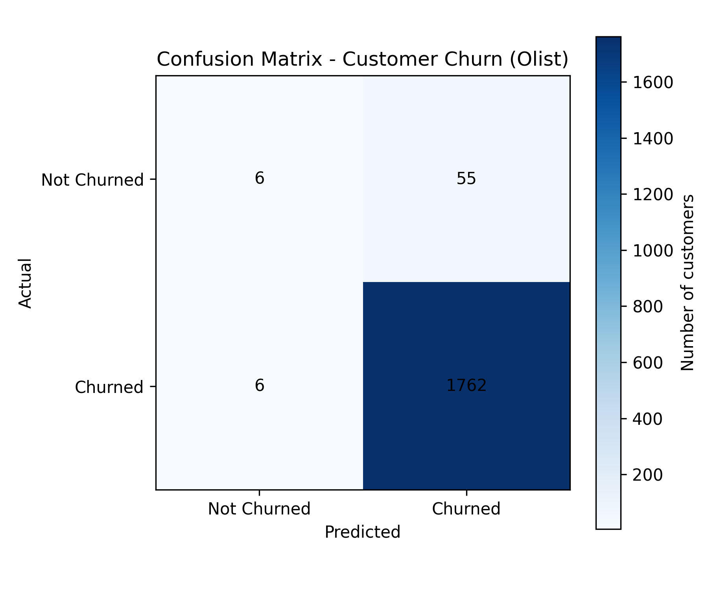
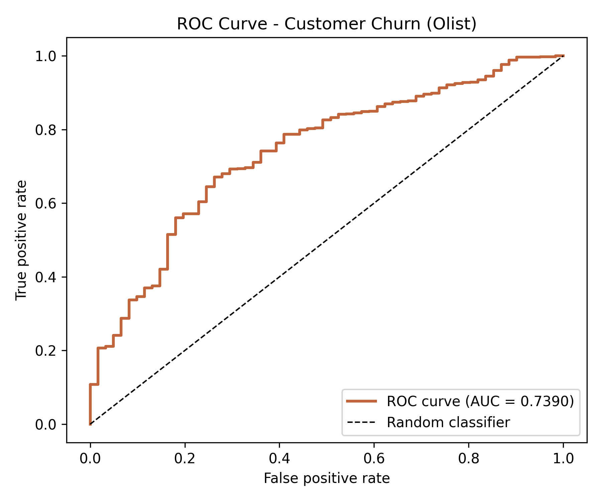
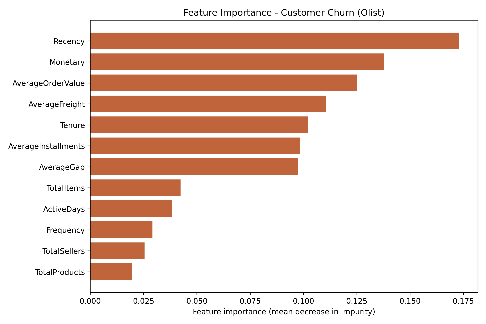
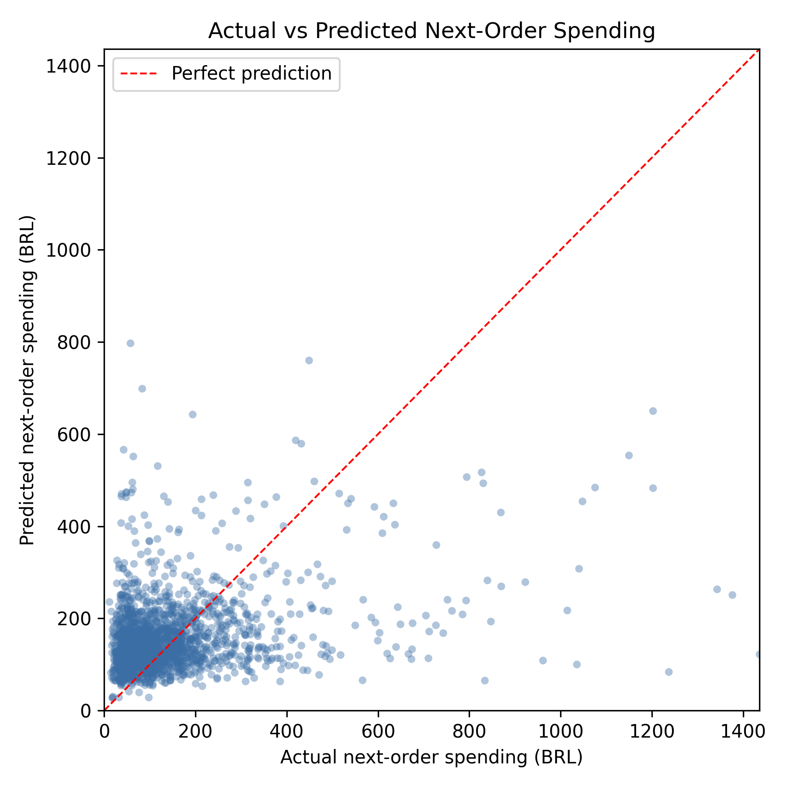
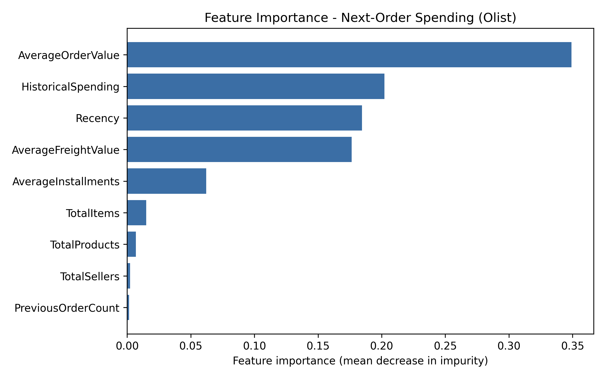
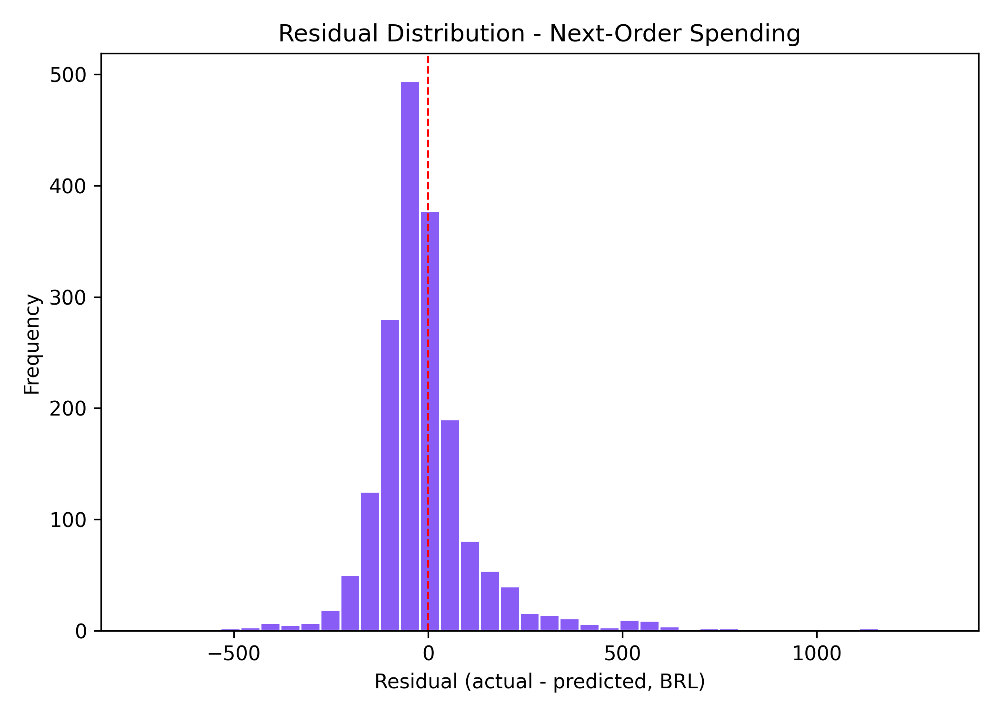
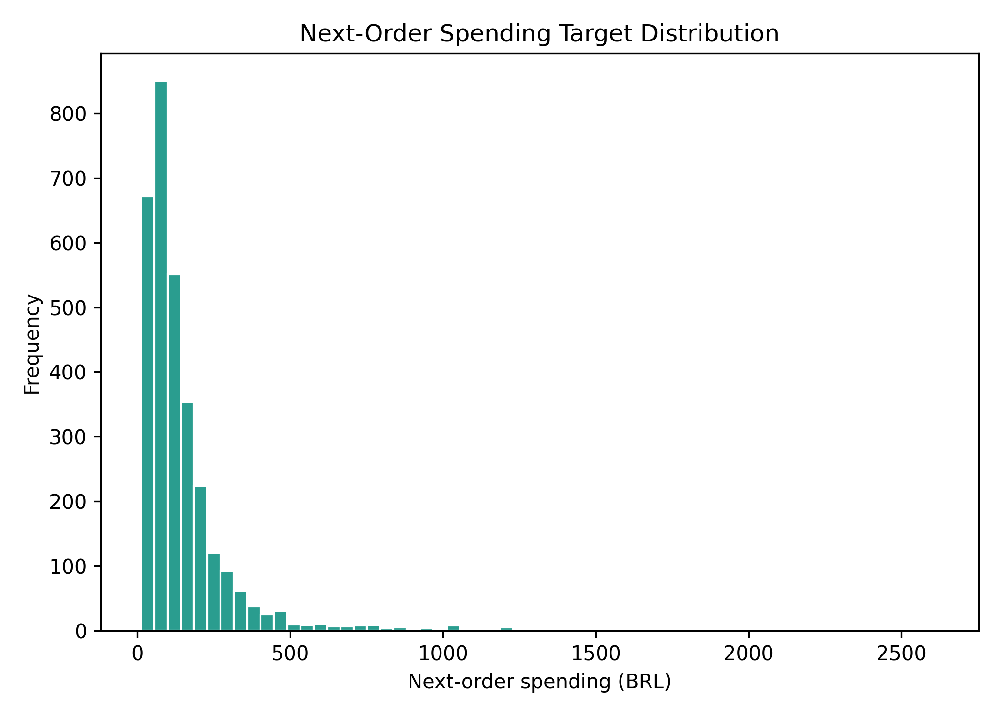
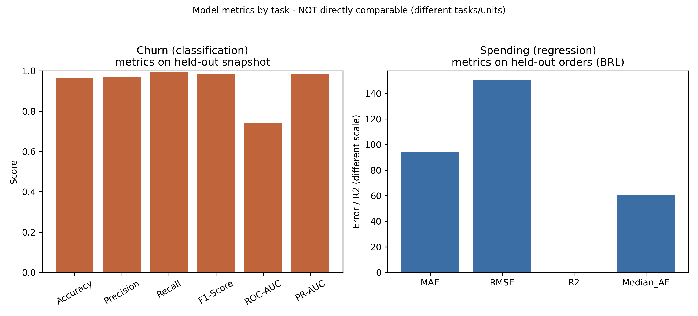

# E-commerce Customer Churn and Spending Prediction using Machine Learning

> **Research Paper Implementation** — Two Random Forest models (a churn classifier and a next-order spending regressor) trained on a **single unified Olist dataset and customer population**, deployed through a Flask web prototype, and combined into a prototype Customer Risk Value indicator.

---

## Table of Contents

1. [Project Overview](#1-project-overview)
2. [Research Questions](#2-research-questions)
3. [Solution Materials and Methodology](#3-solution-materials-and-methodology)
4. [Dataset](#4-dataset)
5. [Data Cleaning and Preprocessing](#5-data-cleaning-and-preprocessing)
6. [Feature Engineering](#6-feature-engineering)
7. [Machine Learning Algorithms Used](#7-machine-learning-algorithms-used)
8. [Tech Stack](#8-tech-stack)
9. [Project Workflow](#9-project-workflow)
10. [Project Structure](#10-project-structure)
11. [Setup and Installation](#11-setup-and-installation)
12. [Reproducing the Models](#12-reproducing-the-models)
13. [Running the Flask Application](#13-running-the-flask-application)
14. [What the Models Evaluate](#14-what-the-models-evaluate)
15. [Outputs and Results](#15-outputs-and-results)
16. [Output Screenshots](#16-output-screenshots)
17. [Customer Risk Value](#17-customer-risk-value)
18. [What Information the System Provides](#18-what-information-the-system-provides)
19. [Tests](#19-tests)
20. [Limitations and Threats to Validity](#20-limitations-and-threats-to-validity)
21. [Reproducibility](#21-reproducibility)

---

## 1. Project Overview

This project addresses two key business intelligence challenges in e-commerce through supervised machine learning:

| Task | Type | Description |
|---|---|---|
| **Customer Churn Prediction** | Binary Classification | Predicts whether a repeat customer will go dormant (no order within 150 days of a snapshot) |
| **Next-Order Spending Prediction** | Regression | Predicts the payment value (BRL) a customer will spend on their next order (conditional on that order existing) |

Both models use the **same Olist source** and the **same customer population** — repeat customers with at least two delivered orders. This is the key change from the earlier two-dataset design (Online Retail II for churn, Olist for spending), which could not describe the same customers.

The two model outputs are combined into a prototype **Customer Risk Value** indicator:

```
Customer Risk Value (BRL) = Churn Probability × Predicted Next-Order Spending
```

Both models are served through a **Flask web application** that accepts CSV uploads, ranks customers by risk value, and returns a results table plus a summary.

> **Important:** The Customer Risk Value is a **prototype indicator**, not a validated financial estimate. The churn target is heavily imbalanced (~96% of repeat customers are dormant within the horizon) and the spending target is conditional on a subsequent order.

---

## 2. Research Questions

| RQ | Question |
|---|---|
| **RQ1** | On a single e-commerce dataset, can a Random Forest distinguish repeat customers who will go dormant from those who keep buying? |
| **RQ2** | Can a Random Forest predict the payment value of a customer's next order from prior-order history alone, without target leakage? |
| **RQ3** | Can the two unified outputs be combined into a transparent, clearly-bounded risk indicator for demonstration purposes? |

---

## 3. Solution Materials and Methodology

### Approach Summary

The project follows a standard supervised machine learning pipeline applied to a **single unified Olist dataset**:

```
Raw Olist tables → Join & Clean → Feature Engineering → Out-of-time Split → Model Training → Evaluation → Serialization → Flask Deployment
```

### Methodology Steps

| Step | Churn Model | Spending Model |
|---|---|---|
| **1. Data Source** | Olist Brazilian E-Commerce (delivered orders) | Olist Brazilian E-Commerce (delivered orders) |
| **2. Population** | Repeat customers (≥ 2 delivered orders) at a snapshot | Repeat-customer order events (orders with prior history) |
| **3. Cleaning** | Keep `delivered` + `payment_value > 0`; aggregate payments/items per order | Same shared cleaning (`prepare_data.py`) |
| **4. Features** | 12 RFM + basket/freight/installments/recency/tenure features (pre-snapshot) | 9 prior-order cumulative features |
| **5. Target** | Churn = 1 if no order within 150 days after the snapshot | NextOrderSpending = payment value of the next order (conditional on it existing) |
| **6. Split** | Out-of-time: train on 2018-01-01 snapshot, test on 2018-04-01 snapshot | Out-of-time: orders before vs after 2018-01-01 |
| **7. Model** | RandomForestClassifier (500 trees, balanced) | RandomForestRegressor (300 trees) |
| **8. Evaluation** | Accuracy, Precision, Recall, F1, ROC-AUC, PR-AUC | MAE, RMSE, R², Median AE |
| **9. Serialization** | `churn_model.pkl` + `churn_features.json` | `spending_model.pkl` + `spending_features.json` |

Both models share the data layer produced by `prepare_data.py`.

---

## 4. Dataset

| Dataset | Source | Role | Size |
|---|---|---|---|
| **Olist Brazilian E-Commerce** | [Kaggle `olistbr/brazilian-ecommerce`](https://www.kaggle.com/datasets/olistbr/brazilian-ecommerce) | BOTH churn and spending models | 99,441 marketplace orders; raw tables in `olist_complete_dataset/` |

### Dataset Details

- Raw tables used by the pipeline: `olist_orders_dataset.csv`, `olist_customers_dataset.csv`, `olist_order_payments_dataset.csv`, `olist_order_items_dataset.csv`.
- The raw tables are joined directly in `prepare_data.py` (no intermediate notebook) into `data/olist_orders_joined.csv`.
- Only **delivered** orders with `payment_value > 0` are kept (96,477 orders, 93,357 customers).
- **Repeat customers (≥ 2 delivered orders): 2,801 (≈ 3.0%)** — this is the shared modelling population.

> The earlier Online Retail II workbook (UK) is **no longer used** by either model. Its files remain in `data/` for provenance only (see [Project Structure](#10-project-structure)).

---

## 5. Data Cleaning and Preprocessing

### Shared Cleaning (`prepare_data.py`)

1. Parse `order_purchase_timestamp` to datetime.
2. Aggregate **payments per order**: `payment_value = sum`, `payment_installments = max` (prevents double-counting multi-row payments).
3. Aggregate **items per order**: count items, distinct products, distinct sellers, sum item price, sum freight.
4. Join customers (to obtain `customer_unique_id`), payments, and items onto orders.
5. Keep only `order_status == "delivered"`.
6. Drop rows missing `customer_unique_id`, `order_purchase_timestamp`, or `payment_value`; keep `payment_value > 0`.
7. Sort by (`customer_unique_id`, `order_purchase_timestamp`) for chronological ordering.

### Churn Snapshot Construction

For a snapshot date `T` (2018-01-01 for train, 2018-04-01 for test):
- Features are computed from orders **strictly before `T`**.
- The target uses orders in the window **[`T`, `T` + 150 days)**.
- Repeat cohort filter: keep customers with ≥ 2 orders before `T`.

### Spending Target Construction

- Sort each customer's orders chronologically.
- All features are cumulative sums of **prior orders only** (first order dropped — no history).
- `NextOrderSpending` = the **next** order's `payment_value` (BRL).

---

## 6. Feature Engineering

### Churn Features — 12 Customer-Level Features

| Feature | Description |
|---|---|
| `Recency` | Days from the customer's last pre-snapshot order to the snapshot |
| `Frequency` | Number of delivered orders before the snapshot |
| `Monetary` | Total spend before the snapshot (BRL) |
| `TotalItems` | Total items across prior orders |
| `TotalProducts` | Total distinct products across prior orders |
| `TotalSellers` | Total distinct sellers across prior orders |
| `AverageFreight` | Mean freight value per order |
| `AverageInstallments` | Mean payment installments per order |
| `AverageOrderValue` | Monetary ÷ Frequency |
| `Tenure` | Days between first and last pre-snapshot order |
| `ActiveDays` | Number of distinct calendar days with orders |
| `AverageGap` | Tenure ÷ (Frequency − 1) — average days between orders |

**Churn Target Definition:**
- `Churn = 1` if the customer places **no** delivered order in the 150 days after the snapshot
- `Churn = 0` otherwise
- **Train snapshot churn rate: 95.8% (1,178 customers); Test snapshot churn rate: 96.7% (1,829 customers)**

### Spending Features — 9 Cumulative Historical Features

For each order, features are **cumulative sums of all previous orders only** (strict leakage control):

| Feature | Description |
|---|---|
| `Recency` | Days since the previous order |
| `PreviousOrderCount` | Count of prior orders (first order dropped — no history) |
| `HistoricalSpending` | Cumulative total spend from prior orders (BRL) |
| `TotalItems` | Cumulative total items from prior orders |
| `TotalProducts` | Cumulative distinct products from prior orders |
| `TotalSellers` | Cumulative distinct sellers from prior orders |
| `AverageOrderValue` | HistoricalSpending ÷ PreviousOrderCount |
| `AverageFreightValue` | Cumulative freight ÷ PreviousOrderCount |
| `AverageInstallments` | Cumulative installments ÷ PreviousOrderCount |

**Next-Order Spending Target:**
- `NextOrderSpending = the next order's payment_value (BRL)`
- Only orders with prior history are included (first order per customer dropped)
- **Leakage control**: target-order quantity, price, freight, and payment fields are never used as features

**Resulting Datasets (`outputs/dataset_summary.csv`):**

| Item | Value |
|---|---:|
| Delivered orders | 96,477 |
| Customers (delivered) | 93,357 |
| Repeat customers (≥ 2 orders) | 2,801 |
| Spending observations (train) | 1,300 |
| Spending observations (test) | 1,820 |
| NextOrderSpending mean (BRL) | 146.92 |
| NextOrderSpending median (BRL) | 100.30 |
| NextOrderSpending max (BRL) | 2,621.29 |

---

## 7. Machine Learning Algorithms Used

### Model 1 — Random Forest Classifier (Churn Prediction)

**Algorithm:** `sklearn.ensemble.RandomForestClassifier`

| Hyperparameter | Value | Rationale |
|---|---|---|
| `n_estimators` | 500 | Larger forest for variance reduction |
| `max_depth` | 8 | Limits overfitting on a small, imbalanced cohort |
| `min_samples_leaf` | 2 | Regularisation on small leaf nodes |
| `class_weight` | `balanced` | Counteracts the ~96% churn base rate |
| `random_state` | 42 | Reproducibility |
| `n_jobs` | -1 | Parallel training on all CPU cores |

**Cross-Validation:** 5-fold Stratified K-Fold on the training snapshot.

### Model 2 — Random Forest Regressor (Spending Prediction)

**Algorithm:** `sklearn.ensemble.RandomForestRegressor`

| Hyperparameter | Value |
|---|---|
| `n_estimators` | 300 |
| `random_state` | 42 |
| `n_jobs` | -1 |

**Split Strategy:** **out-of-time** (chronological), not random:
- 1,300 train observations (orders before 2018-01-01) / 1,820 test observations (orders after)
- 1,178 train customers / 1,685 test customers; 62 customers appear in both
- Every observation still contributes only **prior-order** features, so the 62 overlap customers do not leak target information.

---

## 8. Tech Stack

| Category | Technology | Purpose |
|---|---|---|
| **Language** | Python 3.12 | Core implementation |
| **ML Framework** | scikit-learn ≥ 1.3 | RandomForestClassifier, RandomForestRegressor, metrics |
| **Data Processing** | pandas ≥ 2.0, numpy ≥ 1.24 | Data manipulation, feature engineering |
| **Model Persistence** | joblib ≥ 1.3 | Model serialisation / deserialisation |
| **Visualisation** | matplotlib ≥ 3.7 | All research figures (300 DPI) |
| **Web Framework** | Flask ≥ 3.0 | REST prototype with CSV upload |

### Dependencies (`requirements.txt`)
```
pandas>=2.0
numpy>=1.24
scikit-learn>=1.3
joblib>=1.3
matplotlib>=3.7
openpyxl>=3.1
Flask>=3.0
```

---

## 9. Project Workflow

```
┌─────────────────────────────────────────────────────────────────────────┐
│                    UNIFIED OLIST ML PIPELINE                            │
└─────────────────────────────────────────────────────────────────────────┘

  RAW OLIST TABLES (olist_complete_dataset/)
  ┌──────────────────────────────┐
  │  orders · customers ·        │
  │  order_payments · items      │
  └──────────────┬───────────────┘
                 │  prepare_data.py  (join + clean, no double counting)
                 ▼
  ┌──────────────────────────────────────────────────────────┐
  │  SHARED DELIVERED-ORDER TABLE  →  data/olist_orders_joined.csv │
  └───────────────┬──────────────────────────┬───────────────┘
                  │                          │
                  ▼                          ▼
  ┌──────────────────────────┐   ┌──────────────────────────┐
  │  CHURN DATASET           │   │  SPENDING DATASET        │
  │  repeat customers        │   │  prior-order events      │
  │  12 snapshot features    │   │  9 cumulative features   │
  │  Churn target (150 d)    │   │  NextOrderSpending target│
  └──────────┬───────────────┘   └──────────┬───────────────┘
             │                              │
             ▼                              ▼
  ┌──────────────────────────┐   ┌──────────────────────────┐
  │  SPLIT (out-of-time)     │   │  SPLIT (out-of-time)     │
  │  2018-01-01 / 2018-04-01 │   │  before / after 2018-01  │
  │  1178 train / 1829 test  │   │  1300 / 1820 observations│
  └──────────┬───────────────┘   └──────────┬───────────────┘
             │                              │
             ▼                              ▼
  ┌──────────────────────────┐   ┌──────────────────────────┐
  │  RandomForest Classifier │   │  RandomForest Regressor  │
  │  500 trees, depth=8      │   │  300 trees               │
  └──────────┬───────────────┘   └──────────┬───────────────┘
             │                              │
             ▼                              ▼
  ┌──────────────────────────┐   ┌──────────────────────────┐
  │  ROC-AUC: 0.7390         │   │  MAE: 93.90 BRL          │
  │  PR-AUC:  0.9870         │   │  RMSE: 150.16 BRL        │
  │  Acc:     0.9666         │   │  R²:   0.0426            │
  └──────────┬───────────────┘   └──────────┬───────────────┘
             │                              │
             ▼                              ▼
  ┌──────────────────────────┐   ┌──────────────────────────┐
  │  churn_model.pkl         │   │  spending_model.pkl      │
  │  churn_features.json     │   │  spending_features.json  │
  └──────────┬───────────────┘   └──────────┬───────────────┘
             └──────────────┬───────────────┘
                            ▼
              ┌─────────────────────────────┐
              │   FLASK APPLICATION         │
              │   app.py                    │
              │   • Churn CSV (12 cols)     │
              │   • Spend CSV (9 cols)      │
              │   • Risk value + segments   │
              │   • Ranked table + summary  │
              └─────────────────────────────┘
```

---

## 10. Project Structure

```text
Research_Paper/
├── prepare_data.py                 Unified Olist prep (join → clean → datasets)
├── train_churn.py                  Train churn model, metrics, and figures
├── train_spending.py               Train spending model, metrics, and figures
├── app.py                          Flask application (churn + spending + risk value)
├── requirements.txt                Python dependencies
│
├── data/
│   ├── olist_orders_joined.csv     Joined delivered orders (generated)
│   ├── olist_churn_dataset.csv     Churn snapshot dataset (generated)
│   ├── olist_spending_dataset_prepared.csv  Next-order event dataset (generated)
│   ├── online_retail_II.xlsx       [legacy] old churn source (unused)
│   ├── online_retail_II_cleaned.csv[legacy] (unused)
│   ├── customer_churn_dataset.csv  [legacy] (unused)
│   ├── customer_churn_dataset_     [legacy] (unused)
│   │   enriched.csv
│   ├── ecommerce_customers.csv     [legacy] supplemental reference
│   ├── olist_spending_dataset.csv  [legacy] old ad-hoc join (unused)
│   └── olist_spending_cleaned.csv  [legacy] (unused)
│
├── olist_complete_dataset/         Raw Olist source tables
│   ├── olist_orders_dataset.csv
│   ├── olist_customers_dataset.csv
│   ├── olist_order_payments_dataset.csv
│   ├── olist_order_items_dataset.csv
│   └── (geolocation, reviews, products, sellers, translation — not used)
│
├── models/
│   ├── churn_model.pkl             Serialised Random Forest Classifier
│   ├── churn_features.json         Ordered feature names for churn model
│   ├── spending_model.pkl          Serialised Random Forest Regressor
│   ├── spending_features.json      Ordered feature names for spending model
│   └── risk_thresholds.json        Segment cut-offs (t1, t2)
│
├── outputs/                        Research tables, figures, reports
│   ├── README.md                   Output file catalogue
│   ├── implementation_report.md    Full methodology and interpretations
│   ├── churn_evaluation_metrics.csv
│   ├── churn_classification_report.csv
│   ├── churn_confusion_matrix.csv
│   ├── churn_feature_importance.csv
│   ├── spending_evaluation_metrics.csv
│   ├── spending_feature_importance.csv
│   ├── spending_predictions.csv
│   ├── customer_risk_value_examples.csv
│   ├── dataset_summary.csv
│   ├── experiment_configuration.json
│   ├── churn_confusion_matrix.png
│   ├── churn_feature_importance.png
│   ├── churn_roc_curve.png
│   ├── spending_feature_importance.png
│   ├── spending_actual_vs_predicted.png
│   ├── spending_residuals.png
│   ├── spending_target_distribution.png
│   └── model_metrics_comparison.png
│
├── templates/
│   └── index.html                  Flask UI (two uploads + ranked results + summary)
│
├── sample_inputs/
│   ├── churn_input.csv             10 example churn rows (12 features + customer_id)
│   └── spending_input.csv          10 example spending rows (9 features + customer_id)
│
├── docs/
│   ├── Info.md                     [legacy] project notes
│   └── sample_report.pdf           [legacy] sample report reference
│
├── notebooks/                      [legacy] incremental implementation records
│   ├── model1.ipynb
│   └── model2.ipynb
│
├── combiner.ipynb                  [legacy] old Olist join (superseded by prepare_data.py)
│
└── tests/
    └── test_pipeline.py            Automated pipeline tests (11 tests)
```

> `[legacy]` files are retained for provenance but are **not used** by the current pipeline.

---

## 11. Setup and Installation

### Prerequisites
- Python 3.9 or higher
- pip

### Installation

```bash
# Clone or navigate to the project directory
cd Research_Paper

# Install all dependencies
pip install -r requirements.txt
```

---

## 12. Reproducing the Models

All scripts use `random_state=42` and write results to `outputs/`.

```bash
# Step 1: Build the shared datasets from the raw Olist tables
# Reads:  olist_complete_dataset/*.csv
# Writes: data/olist_orders_joined.csv
#         data/olist_churn_dataset.csv
#         data/olist_spending_dataset_prepared.csv
python prepare_data.py

# Step 2: Train the spending model
# Reads:  data/olist_spending_dataset_prepared.csv
# Writes: models/spending_model.pkl, models/spending_features.json,
#         models/risk_thresholds.json, outputs/spending_*.{csv,png},
#         outputs/dataset_summary.csv, outputs/experiment_configuration.json
python train_spending.py

# Step 3: Train the churn model
# Reads:  data/olist_churn_dataset.csv
# Writes: models/churn_model.pkl, models/churn_features.json,
#         outputs/churn_*.{csv,png}, outputs/model_metrics_comparison.png
python train_churn.py
```

> Run `train_spending.py` before `train_churn.py` so `model_metrics_comparison.png` uses fresh spending metrics. All scripts are deterministic — reruns reproduce the reported metrics.

---

## 13. Running the Flask Application

```bash
python app.py               # Starts at http://127.0.0.1:5000
```

### Application Workflow

1. Navigate to `http://127.0.0.1:5000`
2. Upload two CSV files:
   - **Churn Feature CSV** — 12 historical/behavioural columns (+ optional `customer_id`)
   - **Spending Feature CSV** — 9 prior-order columns (+ optional `customer_id`)
3. Click **Predict and rank by risk value**
4. View the results:
   - **Summary panel** — customers analysed, mean churn probability, mean predicted spending, mean and total risk value
   - **Risk-segment panel** — Low / Medium / High with thresholds and per-segment counts and averages
   - **Ranked table** — customers sorted by Customer Risk Value (highest first)

### Sample Input Files

Use the provided samples in `sample_inputs/` (10 customers each, aligned by `customer_id`):

```bash
# Churn input: 12 feature columns + optional customer_id
sample_inputs/churn_input.csv

# Spending input: 9 feature columns + optional customer_id
sample_inputs/spending_input.csv
```

**Churn CSV required columns (12):**
```
Recency, Frequency, Monetary, TotalItems, TotalProducts, TotalSellers,
AverageFreight, AverageInstallments, AverageOrderValue, Tenure,
ActiveDays, AverageGap
```

**Spending CSV required columns (9):**
```
Recency, PreviousOrderCount, HistoricalSpending, TotalItems,
TotalProducts, TotalSellers, AverageOrderValue,
AverageFreightValue, AverageInstallments
```

### Row Pairing Logic

| Scenario | Behaviour |
|---|---|
| Both files contain `customer_id` | Inner join on `customer_id` |
| One or both files missing `customer_id` | Paired by row order; extra rows ignored |

### Validation Rules

The app rejects uploads with:
- Missing required feature columns
- Non-numeric feature values
- Missing (NaN) feature values
- Negative values in spending features
- Empty files or unreadable CSVs

Returns **HTTP 400** with a descriptive error message per file.

---

## 14. What the Models Evaluate

### Model 1: Churn Classifier — What It Evaluates

The churn model evaluates **binary classification** out-of-time on the 2018-04-01 snapshot (1,829 customers, churn base rate 96.7%):

| Metric | Formula | What It Tells You |
|---|---|---|
| **Accuracy** | Correct predictions ÷ Total | Overall proportion correct — **misleading here** (≈ base rate) |
| **Precision** | TP ÷ (TP + FP) | Of customers predicted as churners, how many actually churned |
| **Recall** | TP ÷ (TP + FN) | Of actual churners, how many were correctly identified |
| **F1-Score** | 2 × (Precision × Recall) ÷ (Precision + Recall) | Harmonic mean of Precision and Recall |
| **ROC-AUC** | Area under the ROC curve | Ability to rank churners above non-churners (0.5 = random) |
| **PR-AUC** | Area under Precision–Recall curve | More informative than ROC-AUC for rare-event targets |
| **Confusion Matrix** | TN, FP, FN, TP counts | Per-class error breakdown |

### Model 2: Spending Regressor — What It Evaluates

The spending model evaluates **regression performance** on 1,820 held-out observations (orders placed after 2018-01-01):

| Metric | Formula | What It Tells You |
|---|---|---|
| **MAE** | Mean(|actual − predicted|) | Average absolute error in BRL — interpretable dollar amount |
| **RMSE** | √Mean((actual − predicted)²) | Square-root error; penalises large errors more than MAE |
| **R²** | 1 − SS_res ÷ SS_tot | Proportion of variance explained (0 = mean-only model, 1 = perfect) |
| **Median AE** | Median(|actual − predicted|) | Robust error estimate; less sensitive to outliers than MAE |

---

## 15. Outputs and Results

### Churn Model Results (out-of-time: 2018-04-01 snapshot, 1,829 customers, base rate 96.7%)

| Metric | Value |
|---|---:|
| Accuracy | 0.9666 |
| Precision (Churned) | 0.9697 |
| Recall (Churned) | 0.9966 |
| F1-Score (Churned) | 0.9830 |
| **ROC-AUC** | **0.7390** |
| PR-AUC | 0.9870 |
| 5-fold CV ROC-AUC (train snapshot) | 0.6313 |

**Confusion Matrix:**

|  | Predicted: Not Churned | Predicted: Churned |
|---|---:|---:|
| **Actual: Not Churned** | 6 (TN) | 55 (FP) |
| **Actual: Churned** | 6 (FN) | 1762 (TP) |

> Because churn is a ~96% base-rate event, accuracy is only trivially above the base rate and should **not** be read as skill. The minority "Not Churned" class has precision 0.50 / recall 0.10. **ROC-AUC = 0.739** is the honest headline (ranked risk is meaningfully better than random).

### Spending Model Results (out-of-time: 1,820 orders after 2018-01-01)

| Metric | Value |
|---|---:|
| MAE (BRL) | **93.90** |
| RMSE (BRL) | **150.16** |
| R² | **0.0426** |
| Median AE (BRL) | **60.52** |

**Predicted vs Actual Summary:**

| Statistic | Actual (BRL) | Predicted (BRL) | Residual (BRL) |
|---|---:|---:|---:|
| Mean | 148.75 | 157.70 | -8.94 |
| Std | 153.51 | 82.97 | 149.94 |
| Min | 11.56 | 26.83 | -739.41 |
| Median | 104.40 | 137.36 | -28.30 |
| Max | 1435.97 | 797.11 | 1314.01 |

> R² = 0.043 means prior-order history explains ~4% of held-out next-order variance — a **weak but positive** signal. The narrower predicted range shows the regressor shrinks toward the mean (typical for tree ensembles on skewed targets).

### Top Feature Importances

**Churn Model — Feature importance (mean decrease in impurity):**

| Rank | Feature | Importance |
|---:|---|---:|
| 1 | Recency | 0.173 |
| 2 | Monetary | 0.138 |
| 3 | AverageOrderValue | 0.125 |
| 4 | AverageFreight | 0.111 |
| 5 | Tenure | 0.102 |
| 6 | AverageInstallments | 0.098 |
| 7 | AverageGap | 0.097 |
| 8 | TotalItems | 0.042 |
| 9 | ActiveDays | 0.038 |
| 10 | Frequency | 0.029 |
| 11 | TotalSellers | 0.026 |
| 12 | TotalProducts | 0.020 |

**Spending Model — Feature importance (mean decrease in impurity):**

| Rank | Feature | Importance |
|---:|---|---:|
| 1 | AverageOrderValue | 0.349 |
| 2 | HistoricalSpending | 0.202 |
| 3 | Recency | 0.185 |
| 4 | AverageFreightValue | 0.176 |
| 5 | AverageInstallments | 0.062 |
| 6 | TotalItems | 0.015 |
| 7 | TotalProducts | 0.007 |
| 8 | TotalSellers | 0.002 |
| 9 | PreviousOrderCount | 0.001 |

> Feature importance reflects **predictive contribution within the fitted forest**, not causation.

### Old vs New Methodology

| Aspect | Old methodology | New (unified) methodology |
|---|---|---|
| Churn source | Online Retail II (UK, 2009–2011) | Olist (Brazil, delivered orders) |
| Shared population? | No (two datasets) | Yes — repeat customers (≥ 2 orders) |
| Churn target | no purchase in 90 days (base 43%) | no order within 150 days (base ~96%) |
| Split | churn random; spending random | both **out-of-time** |
| Churn ROC-AUC | 0.7297 | **0.7390** |
| Spending R² | 0.0608 | **0.0426** (stricter out-of-time) |

---

## 16. Output Screenshots

### Churn Model — Confusion Matrix

Confusion matrix on 1,829 held-out snapshot customers. TN = 6, TP = 1762, FP = 55, FN = 6 — the model captures almost all churners but rarely identifies the few returning customers (rare-event behaviour).



---

### Churn Model — ROC Curve

The ROC curve plots True Positive Rate against False Positive Rate across thresholds. AUC = 0.7390 indicates the model ranks churners above non-churners substantially better than chance (0.5).



---

### Churn Model — Feature Importance

`Recency` (0.173), `Monetary` (0.138) and `AverageOrderValue` (0.125) lead — classic RFM signals dominate dormant-customer prediction, with `AverageFreight` and `Tenure` close behind.



---

### Spending Model — Actual vs Predicted

Actual vs predicted next-order spending on the held-out orders. Points on the red dashed line are perfect predictions; the model regresses toward the mean (predicted range is narrower than actual), typical for Random Forest regressors on skewed targets.



---

### Spending Model — Feature Importance

`AverageOrderValue` (0.349) is the strongest predictor of next-order spending, followed by `HistoricalSpending` (0.202) and `Recency` (0.185). The top 4 features account for ~91% of total importance.



---

### Spending Model — Residual Distribution

The residual histogram (actual − predicted) is centred slightly below zero, with most residuals within ±250 BRL. A small number of large residuals correspond to high-value actual orders the model underestimates.



---

### Spending Model — Target Distribution

The next-order spending distribution is right-skewed, with most orders below BRL 500 and a long tail extending to ~BRL 2,600. This skewness contributes to the low R² and is a key modelling challenge.



---

### Combined — Model Metrics Comparison

Side-by-side comparison of both model metrics. The two panels measure different quantities (classification scores vs regression errors in BRL) and are **not directly comparable**.



---

## 17. Customer Risk Value

### Formula

```
Customer Risk Value (BRL) = Churn Probability × Predicted Next-Order Spending
```

Where:
- **Churn Probability** ∈ [0.0, 1.0] — output of the Random Forest Classifier
- **Predicted Next-Order Spending** ≥ 0 (BRL) — output of the Random Forest Regressor (clipped to non-negative)

### Risk Segments (mathematically defined)

Thresholds are the **33rd and 66th percentiles of the held-out predicted-spending distribution**, stored in `models/risk_thresholds.json`:

| Segment | Rule | Threshold |
|---|---|---|
| **Low** | `R ≤ t1` | `t1 = 116.62` |
| **Medium** | `t1 < R ≤ t2` | `t2 = 165.09` |
| **High** | `R > t2` | — |

On this population the churn probability is near-constant (~0.96), so the segment is effectively driven by predicted spending. This is stated rather than hidden.

### Interpretation

| Churn Probability | Predicted Spending (BRL) | Risk Value (BRL) | Interpretation |
|---:|---:|---:|---|
| 0.00 | 500.00 | 0.00 | No churn risk — no at-risk revenue |
| 0.25 | 500.00 | 125.00 | 25% churn risk on R$500 potential spend |
| 0.50 | 500.00 | 250.00 | Equal chance of churning, R$250 at risk |
| 0.75 | 500.00 | 375.00 | High churn risk, R$375 potential loss |
| 1.00 | 500.00 | 500.00 | Full spend value at risk |

Illustrative sensitivity examples are in `outputs/customer_risk_value_examples.csv`.

### Limitations

> **The Customer Risk Value is a prototype demonstration indicator, not a validated financial estimate.**
> - The churn target is heavily imbalanced (~96% base rate) and the spending target is **conditional on a subsequent order existing**
> - No causal relationship between churn and revenue loss is established
> - The churn probability is near-constant on this population, so the combined value is dominated by predicted spending
> - The combined value should be treated as a relative prioritisation signal only

---

## 18. What Information the System Provides

### Per-Customer Predictions (Flask App Output)

For each row in the uploaded CSVs, the system returns:

| Output Field | Type | Description |
|---|---|---|
| `customer_id` | String | Customer identifier (if provided), otherwise `row_N` |
| `churn_probability` | Float [0, 1] | Estimated probability of dormancy within the horizon |
| `predicted_churn` | String | `"Churned"` or `"Not Churned"` (threshold: 0.5) |
| `predicted_next_order_spending_BRL` | Float ≥ 0 | Predicted BRL value of the customer's next order |
| `customer_risk_value_BRL` | Float ≥ 0 | churn_probability × predicted_next_order_spending_BRL |
| `risk_segment` | String | `"Low"`, `"Medium"`, or `"High"` per the thresholds above |

Rows are **sorted by Customer Risk Value (highest first)** and the page is labelled a **prototype estimate**.

### Batch Summary Statistics

The results page also shows:
- **Customers analysed**
- **Mean churn probability**
- **Mean predicted spending**
- **Mean Customer Risk Value**
- **Total Customer Risk Value** (portfolio-level indicator)
- **Per-segment counts and averages** (Low / Medium / High)
- **Pairing note**: whether rows were joined on `customer_id` or paired by row order

### Research Output Files (Generated by Training Scripts)

| File | Description |
|---|---|
| `outputs/churn_evaluation_metrics.csv` | Accuracy, Precision, Recall, F1, ROC-AUC, PR-AUC, base rate |
| `outputs/churn_classification_report.csv` | Per-class precision/recall/F1/support |
| `outputs/churn_confusion_matrix.csv` | TN/FP/FN/TP counts |
| `outputs/churn_feature_importance.csv` | Feature importance scores (all 12 features) |
| `outputs/spending_evaluation_metrics.csv` | MAE, RMSE, R², Median AE |
| `outputs/spending_feature_importance.csv` | Feature importance scores (all 9 features) |
| `outputs/spending_predictions.csv` | Actual, predicted, residual per test observation |
| `outputs/customer_risk_value_examples.csv` | Example risk values at 5 churn probability levels |
| `outputs/dataset_summary.csv` | Dataset row/customer counts and target statistics |
| `outputs/experiment_configuration.json` | Spending model config, feature order, split info, verification |
| `outputs/implementation_report.md` | Full methodology, interpretations, and limitations |

---

## 19. Tests

```bash
# Run all tests
python tests/test_pipeline.py

# Or with pytest
pytest tests/test_pipeline.py -v
```

**Results: 11 passed, 0 failed**

| Test | Description |
|---|---|
| Churn model load | Model file exists and is loadable |
| Churn model type | Confirms `RandomForestClassifier` |
| Churn feature count | Model expects exactly 12 features |
| Churn probability range | All probabilities ∈ [0, 1] |
| Churn output shape | Output shape matches input rows |
| Spending model load | Model file exists and is loadable |
| Spending model type | Confirms `RandomForestRegressor` |
| Spending feature count | Model expects exactly 9 features |
| Spending feature order match | Saved JSON order matches model training order |
| Spending prediction finite | No NaN or Inf in predictions |
| Risk value: edge cases | prob = 0 → 0; prob = 1 → spending; intermediate; non-negative |
| Flask main route | GET / returns HTTP 200 |
| Valid two-file upload | Produces results table with risk column |
| Missing churn columns | Returns HTTP 400 with error message |
| Missing spending columns | Returns HTTP 400 with error message |
| Non-numeric rejection | Returns HTTP 400 for non-numeric feature values |
| Row-order pairing | Pairs by row order when customer_id absent |

---

## 20. Limitations and Threats to Validity

| Limitation | Description |
|---|---|
| **Rare-event churn** | ~96% of repeat customers do not buy within 150 days; minority-class recall is low and accuracy ≈ base rate. AUC is the informative metric |
| **Conditional spending target** | The spending model predicts the next order's value **conditional on a subsequent order existing** — never-reordering customers are excluded from the regression set |
| **Weak spending signal** | R² = 0.043 — prior-order history explains only ~4% of held-out variance; predictions are weak signals for individuals |
| **Olist is not a subscription business** | "Churn" means long-run inactivity after a repeat purchase, not contract cancellation |
| **Horizon / cut-off choices** | The 150-day horizon and 2018-01-01 / 2018-04-01 cut-offs are design choices, not validated optima |
| **No significance testing** | Metric differences are not tested for statistical significance |
| **Feature importance ≠ causation** | MDI importance reflects predictive contribution, not causal effect |
| **Risk value not financially validated** | It is a prototype demonstration, not a validated financial or business outcome |

---

## 21. Reproducibility

All scripts use `random_state=42` for full determinism.

```bash
# 1. Install dependencies
pip install -r requirements.txt

# 2. Build the shared datasets from the raw Olist tables
python prepare_data.py
# → data/olist_orders_joined.csv
# → data/olist_churn_dataset.csv
# → data/olist_spending_dataset_prepared.csv

# 3. Reproduce the spending model, metrics, and figures
python train_spending.py
# → models/spending_model.pkl, models/spending_features.json, models/risk_thresholds.json
# → outputs/spending_*.csv, outputs/spending_*.png
# → outputs/dataset_summary.csv, outputs/experiment_configuration.json

# 4. Reproduce the churn model, metrics, and figures
python train_churn.py
# → models/churn_model.pkl, models/churn_features.json
# → outputs/churn_*.csv, outputs/churn_*.png
# → outputs/model_metrics_comparison.png

# 5. Start the Flask application
python app.py
# → http://127.0.0.1:5000

# 6. Run automated tests
python tests/test_pipeline.py
# → 11 passed, 0 failed
```

Full methodology, interpretations, and limitations are documented in [`outputs/implementation_report.md`](outputs/implementation_report.md).

---

*Research paper implementation — E-commerce Customer Churn and Spending Prediction using Machine Learning*
